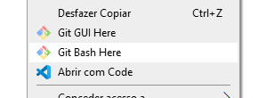
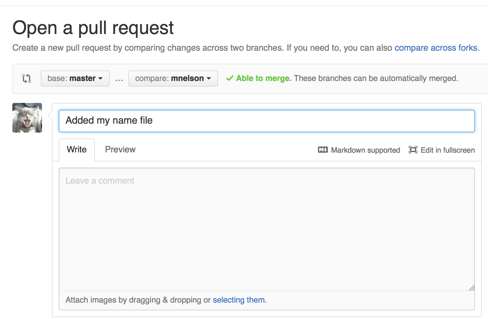

# Tutorial de Git e GitHub

Minhas anotações pessoais sobre como utilizar o Git e o GitHub.

## Como instalar o git

Vá para o site: https://git-scm.com/ e baixe a última versão. A instalação irá perguntar várias coisas, se estiver na dúvida em o que escolher, não mexa em nada e apenas clique em “Next”.

Por padrão é instalado o “bash” que é um prompt de comandos muito útil, e para abrir ela em qualquer diretório, basta clicar com o botão direito na pasta e selecionar “Git Bash Here”, e é nela que você entrará os comandos git.



## Como utilizar o git

Navegue até a pasta do projeto e execute o comando: `git init` para inicializar o repositório git, uma pasta oculta `.git` será criada e nela será armazenado o repositório.

Crie os arquivos do seu projeto.

Cada mudança do repositório é chamada de `commit`. Para colocar um arquivo no  commit, é necessário rodar o comando `git add <nome do arquivo>`. Para adicionar todos os arquivos do projeto, rode `git add .`.

Os arquivos adicionados são chamados de “staged files”, stage significa palco, é como se os arquivos que vão ser “commitados” estejam em um palco, e os arquivos que não serão commitados (unstaged files), não estão no palco. Para saber quais arquivos foram modificados e quais estão staged ou unstaged, rode o comando: `git status`. Este comando também te ensina como remover arquivos do “stage” (palco).

Para criar um commit, simplesmente rode o comando: `git commit -m “Mensagem do commit”`. É muito importante que a mensagem explique bem e resumidamente quais alterações foram feitas no código. Para uma utilização mais profissional do git também, é recomendável fazer pequenos commits frequentemente a cada modificação do código.

É possível criar “branches” também, que são ramificações do projeto. Vamos supor que você quer adicionar uma nova funcionalidade ao seu programa, mas não quer arriscar modificar o código original. Para isso que servem as branches: você cria uma nova linha do tempo para o seu projeto, trabalha na nova funcionalidade, e quando ela estiver perfeitamente funcional, aí sim pode fazer o “merge” que mescla a nova linha do tempo com a original, que é chamada de “master”. Caso a funcionalidade atrapalhe o programa, você descarta a linha do tempo criada e volta a trabalhar na master, que ficou inalterada. Para criar uma nova “branch” rode o comando: `git checkout -b <nome da branch>`. Para mudar de branch, rode o mesmo comando só que sem o `-b`.

## Como salvar um repositório no GitHub

Crie um novo repositório no GitHub, não inicialize o repositório com `README.md`, nem adicione o `.gitignore` ou license. Assim que você criar, irá aparacer uma mensagem com instruções. Siga a instrução que começa com “...or push an existing repository from the command line”. Se for a primeira vez sua utilizando o Git e GitHub, aparecerá uma janela pedindo para se logar no GitHub. Na próxima vez que você utilizar, as suas credenciais já estarão salvas no computador e não será necessário se logar novamente. Caso queira remover suas credenciais do computador, vá em Painel de Controle → Contas de Usuário → Gerenciar suas credenciais → Credenciais do Windows.

O nome “origin” do comando utilizado para salvar o repositório no GitHub, existe pois ao criar um clone de um repositório remoto na sua máquina local, o git cria um nome para você, quase sempre esse nome é “origin”, esse nome nada mais é do que um encurtamento da URL do repositório remoto, para você não precisar toda vez digitar a URL completa.


Um Pull Request é uma maneira de alertar o dono do repositório que você deseja fazer mudanças no código. Isso permite eles fazerem a revisão do seu código antes de fazer um “merge” com a master branch.



E essa é a tela que aparece quando alguém está revisando o código:


Todo commit possui um código hash que é um identificador único. Para desfazer mudanças, basta usar o comando: `git revert <código hash do commit>` que o código vai “voltar no tempo” para aquele commit específico.

Para transferir mudanças de código do repositório remoto no seu repositório local, utilize o comando `git pull`. Para transferir mudanças de código do seu repositório local para o repositório remoto, utilize o comando `git push`.

Ao utilizar um repositório https, o git pode ficar pedindo suas credenciais toda vez que você fizer um push ou pull. Para resolver isso, digite o seguinte comando: `git config --global credential.helper cache -timeout=600`. O valor de timeout pode ser modificado de acordo com a sua preferência. É importante colocar o timeout pois sua senha será armazenada em um arquivo de texto no seu computador, sem criptografia, então é um risco de segurança se você esquecer de apagar ela. Caso apareça alguma janela, apenas feche ela que suas credenciais ficaram temporariamente salvas agora, para evitar a inconveniência de digitá-las toda vez.

Para fazer um merge de uma branch com a master branch, utilize: `git merge <nome da branch> -m “mensagem explicando o merge”`

Muitas vezes você pode achar um repositório online e desejar cloná-lo em sua máquina, para fazer isso basta rodar o famoso comando: `git clone <url do repositorio>`.

Outra coisa importante é o arquivo `.gitignore` onde você coloca o nome de outros arquivos e diretórios que não deseja que sejam adicionados no repositório. Ele é útil pois alguns arquivos não são necessários de se adicionar no repositório e só estariam ocupando espaço e tempo de processamento à toa ao se fazer os commits.

É recomendável também criar um arquivo `README.md` que explicará sobre o projeto em questão. Isso é especialmente útil ao criar repositórios públicos que estarão disponíveis para outras pessoas colaborarem, pois elas precisam saber sobre o que o projeto se trata.

Algumas IDEs como o Visual Studio Code, possuem integração com o Git, onde é possível através da própria interface gráfica fazer os comandos Git, sem precisar digitá-los no terminal.

Para aprender mais sobre Git, consulte a documentação no site oficial: https://git-scm.com/doc.

Para aprender mais sobre GitHub, consulte a ajuda do site oficial: https://help.github.com/en/github 

## Como normalmente funciona um git workflow (fluxo de trabalho)

Na master fica o código base, que deve estar sempre funcionando. Quando vai se trabalhar no código para adicionar uma funcionalidade, é criada uma branch para aquela funcionalidade. Caso a master se atualize nesse meio tempo, é necessário puxar as atualizações da master para a branch que se está trabalhando. Quando a funcionalidade está implementada, é feito um pull request, para juntar a branch da funcionalidade com a master. Geralmente esse pull request é avaliado por outras pessoas além das que trabalharam na branch, caso seja aceita, a master é atualizada com a nova funcionalidade. Normalmente depois de se fazer um pull request, se a feature está finalizada, é comum deletar a branch, para não ficarem muitas branches desnecessárias no projeto.


### Como puxar as atualizações da master (ou outra branch base):

* `git status` - para ver se tem alterações na sua branch que não foram comitadas

  * Se tiver alterações não comitadas:
  ```
  git add .
  git commit -m "Mensagem do commit"
  ```

* `git checkout master` - Vai para a master

* `git pull` - Puxa as alterações da master

* `git checkout [NOME DA SUA BRANCH]` - Volta para sua branch

* `git merge master` - Mescla a master que foi baixada com atualizações, terá conflitos e você precisa resolver estes conflitos. Nos arquivos onde ocorreram conflitos, haverão indicações indicando as alterações que vieram da master e o código seu como estava antes, você terá que decidir quais alterações vai querer manter ou modificar e o que você quer mudar no seu código. Resolvidos os conflitos, é um bom hábito dar um "git status" para verificar o status do repositório. **OBS:** como alternativa, você pode usar o comando `git rebase -i master` que é mais correto. Se escolher essa alternativa, você não precisará fazer os dois próximos passos. [Diferenças entre merge e rebase](https://www.atlassian.com/br/git/tutorials/merging-vs-rebasing)

* `git add .` - Para adicionar as modificações feitas para resolver os conflitos

* `git commit -m "Merge adjust"` - Normalmente se usa essa mensagem de commit, porém ela pode ser padronizada de forma diferente dependendo do projeto

* `git push origin [NOME DA SUA BRANCH]` - Fará o "push" da sua branch local atualizada com as alterações da master para o repositório local. O nome "origin" é o nome do seu repositório remoto, que costuma ter este nome padronizado, porém isso pode mudar caso você tenha dado outro nome quando adicionou o repositório remoto.

### Caso você tenha feito commit em uma branch errada (como resolver):

* Muda para a branch errada (onde o commit foi feito) e mostra o log, assim você identifica o commit e pega o id do commit:
```
git checkout branch-errada
git log
```

* Muda para a branch certa (onde o commit deveria estar) e copia o commit para a branch atual:
```
git checkout branch-certa
git checkout cherry-pick <id-do-commit>
```

* Muda para a branch errada e aplica o revert no commit indesejado, assim a branch segue sem essas alterações:
```
git checkout branch-errada
git revert <id-do-commit>
```
